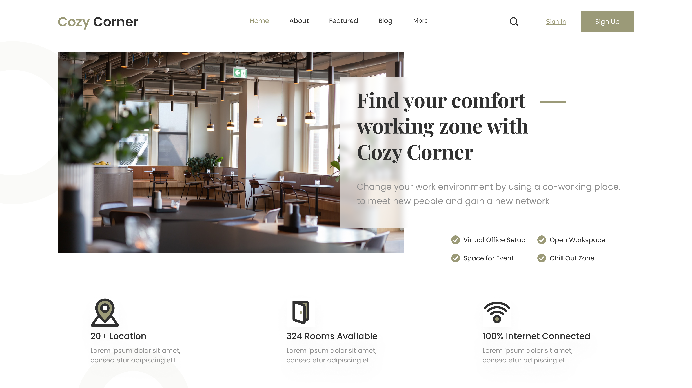

# HTML-CSS Header Coworking Space

## Descripción del proyecto

En este proyecto encontrarás el encabezado de "Cozy Corner", una plataforma que ofrece espacios de coworking diseñados para proporcionar un ambiente de trabajo cómodo y productivo. El objetivo de la empresa es conectar a profesionales y empresas que buscan un lugar flexible y acogedor para desarrollar sus proyectos

Un simple vistazo al header nos permite conocer sus características principales:

+ Espacios versátiles y confortables

+ Ubicación estratégica
  
+ Conectividad

+ Zonas de Chillout y Eventos

## Vista previa del diseño

En la siguiente imagen se aprecia un detalle del resultado obtenido:

> [!IMPORTANT]
> Este encabezado está diseñado para ofrecer una experiencia visual óptima en pantallas con una resolución de 1200px. De este modo se garantiza que los elementos visuales y la disposición del contenido se presenten de manera atractiva y efectiva en pantallas de este tamaño. 🖥️

## Uso

Puedes reutilizar el código para tu propio proyecto web. Simplemente descárgate el repositorio y añádele los cambios necesarios para integrarlo en tu sitio.

## Contribuciones

¡Se aceptan contribuciones, claro que sí! Si encuentras algún problema o tienes alguna sugerencia de mejora, no dudes en ponerte en contacto conmigo y aportar tus ideas. Te lo agradeceré infinitamente :handshake:

 
